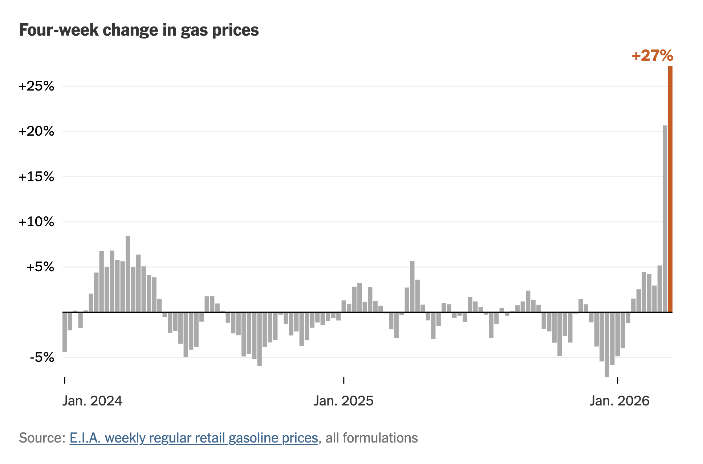
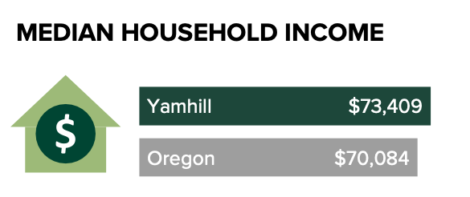

```{r}
#| echo: false
library(tidyverse)
library(palmerpenguins)
```

## What is the most confusing thing about ggplot?

Please put your answer in the chat!

# Agenda

1. Housekeeping

1. ggplot

1. Data viz questions

1. Data viz exercise

1. Next week


::: {.notes}
https://rin3fall2026.rfortherestofus.com/slides/slides-week-03.html
:::

# Housekeeping {.inverse}

## Housekeeping

- Videos for from second half of course are being added this week

- RStudio

- Live session during catch-up week (April 9) on using AI with R. Email us your questions!

::: {.notes}
RStudio

- Not going away (similar to RMarkdown vs Quarto)
- Posit surprised by continued use so made Posit Assistant
- Nothing wrong with using it

We'll discuss in live session: 

- Various ways to use AI (fix + explain, Positron Assistant, Posit Assistant, Claude Code, etc)
- AI + data privacy
:::

# ggplot {.inverse}

---

[](https://www.nytimes.com/2026/03/18/upshot/gas-prices-lookup.html)

::: {.notes}
https://www.nytimes.com/2026/03/18/upshot/gas-prices-lookup.html
:::

# Data Viz Questions {.inverse}

## `==` and lowercase `x` and `y`

. . .

```{r}
#| eval: false
penguins |>
  filter(species == "Gentoo")
```

. . .

```{r}
#| eval: false
ggplot(
  data = penguins, # why can't I use == within this function?
  mapping = aes(
    x = flipper_length_mm, # must be lowercase x and y
    y = body_mass_g
  )
) +
  geom_point()
```


## Color vs fill

> Why is it that the `color=` option is treated differently by `geom_point` and `geom_col`? The logic seems inconsistent here since `color=` is used as if it is `fill=` by `geom_point`. What if I want the scatter plot to have black dots with outline color different by island?

## Assessment break



You want a scatter plot of `bill_length_mm` vs. `bill_depth_mm` with **black-filled** dots whose **outline** color differs by `island`. Which `geom_point()` call does this?

:::{.small}
1. `geom_point(aes(color = island), fill = "black")`
1. `geom_point(aes(color = island), fill = "black", shape = 21)`
1. `geom_point(aes(fill = island), color = "black")`
1. `geom_point(aes(outline = island), color = "black")`
:::

## Assessment break

You want a scatter plot of `bill_length_mm` vs. `bill_depth_mm` with **black-filled** dots whose **outline** color differs by `island`. Which `geom_point()` call does this?

::: {.nonincremental}
:::{.small}
1. `geom_point(aes(color = island), fill = "black")`
1. [**`geom_point(aes(color = island), fill = "black", shape = 21)`**]{.mark}
1. `geom_point(aes(fill = island), color = "black")`
1. `geom_point(aes(outline = island), color = "black")`
:::
:::

:::{.notes}
**2**

`color` always means the outline/stroke and `fill` the interior, for both `geom_point()` and `geom_col()`. The default point shape 19 is solid with no separate interior, so `color` paints the whole dot and `fill` is ignored. Shapes 21–25 have a border (`color`) and an interior (`fill`), so `shape = 21` with `fill = "black"` and `aes(color = island)` gives black dots with island-colored outlines. Add `stroke = 1.5` to make the outline easier to see.

- 1: `fill` is ignored because the shape is still 19.
- 3: Reverses the roles. It also needs `shape = 21` for `fill` to show.
- 4: `outline` is not a ggplot2 aesthetic.
:::

## Is there a "correct" order to put geoms, scales, themes, etc? {.inverse}

## Width of bars in bar charts {.inverse}

## Reordering bar charts {.inverse}

::: {.notes}
https://rfortherestofus.com/courses/r-in-3-months-spring-2026/lessons/reorder-plots-to-highlight-findings-positron
:::

## Wrapping long text in charts {.inverse}

# Data Viz Exercise {.inverse}

## Data Viz Exercise



::: notes
- https://raw.githubusercontent.com/rfortherestofus/rin3-spring-2026/refs/heads/main/misc/median-income-viz.R
- https://graciellehigino.quarto.pub/rin3-data-viz-exercise-yamhill-income/
:::

# Next Week

You'll be learning about Quarto!

- Course assignment: learn the basics of Quarto

- Project assignment: take what you've done so far and turn it into a Quarto document
